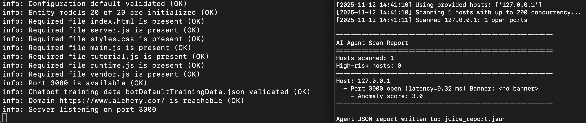

## AI Agent — Network Scan & Vulnerability Reporter
This ai agent can scan the network to discover live hosts, identify open ports and services, and surface likely risky or vulnerable findings.

Key features
 - Fast LAN discovery (ARP or TCP-based ping sweep) and async TCP connect port scanning.
 - Simple banner grabbing and protocol-aware fingerprints (HTTP, SSH, FTP, etc.).
 - Local CVE-pattern matching (configurable) to flag likely vulnerable software.
 - Heuristics to mark executable/sensitive services (SSH, RDP, SMB, databases).
 - Exports results to agent_report.json and prints a concise, prioritized report.
 - Designed for safe, authorized testing on your own hosts (not for scanning external systems).


### Test
To test the agent with OWASP Juice Shop (Docker),
```
# pull & run Juice Shop; exposes on host port 3000
docker run --rm -p 3000:3000 bkimminich/juice-shop
```
Then, from the same machine, run ai agent against localhost:
```
# in the folder with ai_agent.py + network_scanner.py
python3 ai_agent.py --hosts 127.0.0.1 --ports 3000 --mode ping --out juice_report.json
```


To test with DVWA (Damn Vulnerable Web App) — Docker,
```
docker run --rm -p 80:80 vulnerables/web-dvwa
# then scan:
python3 ai_agent.py --hosts 127.0.0.1 --ports 80 --mode ping --out dvwa_report.json
```


